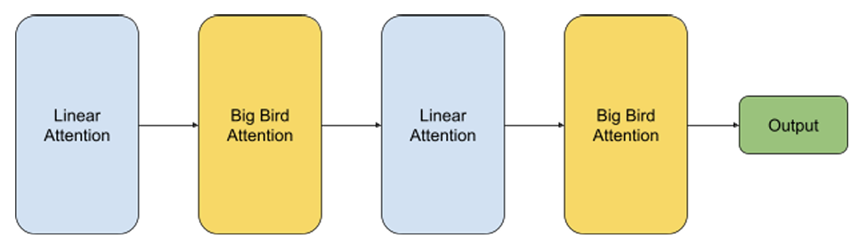

# Hybrid_LA_BB_transformer

This project explores a hybrid transformer architecture that combines linear attention and sparse attention (BigBird) mechanisms to efficiently model long-range dependencies in long-sequence data. Traditional transformers suffer from quadratic computational complexity, making them impractical for long sequences. Our hybrid model alternates between linear and sparse attention layers, achieving sub-quadratic complexity while maintaining strong performance on tasks requiring long-range reasoning.

### Architecture

### Key Contributions

* Efficient Attention Mixing: Evaluated the efficacy of combining block-sparse attention (BigBird) and linear attention to handle long-range dependencies.
* Performance Trade-offs: Explored the balance between computational efficiency and model performance across different tasks.
* Benchmarking: Tested the hybrid model on the Long Range Arena (LRA) benchmark, including ListOps (structural reasoning) and IMDB text classification (semantic integration).

### Technologies used

* Programming Language: Python
* Frameworks: PyTorch, HuggingFace Transformers, TensorFlow 
* Tools: NVIDIA CUDA Toolkit, Google Colab, TensorBoard
* Models: Custom implementations of Linear Attention and BigBird, adapted from HuggingFace.

